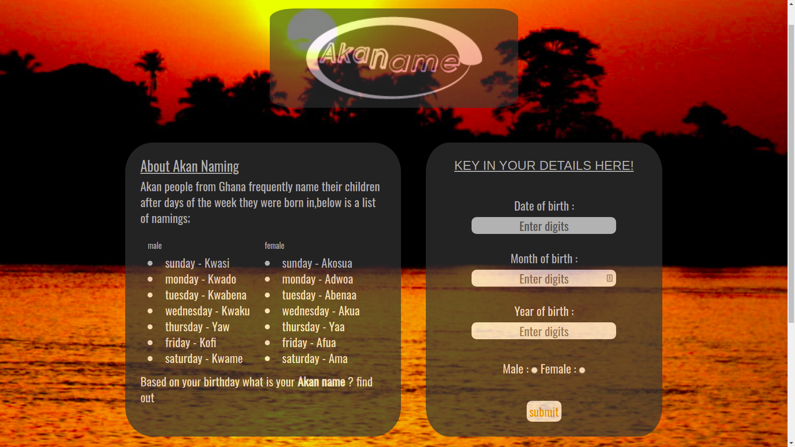

##  AKAN NAMING

### Project description:
>Akan name webpage is a platform that gives users an opportunity to travel to west africa and get themselves an Akan name based on their birthdays.Akan is a group people in ghana with the culture of naming their child borns based on the days they were born.for instance male children born on sunday are called "Kwasi".

## author : Moses Gakuhi 

### Setup Information
* With access to internet one can load the webpage
*  Use your prefered browser 
* You also need a github account to access the link below which will load to the webpage

## link 

[click to access site!!](https://mosesgakuhi1857.github.io/Akan-name/)

### BDD
bugs experienced is for persons whose birthdays are in leap year precisely born on 29th february they might not get the exact AKAN name but it an issue am sorting out. 

### tech used 
* Html
* Css 
* Bootstrap
* java Script

### contact information
buy me coffee:  
tel +254798015111

### screenshot of the page:

### Lincence

  developer Moses Kings

  copyright &copy; 2021 [MIT](https://opensource.org/licenses/MIT)

